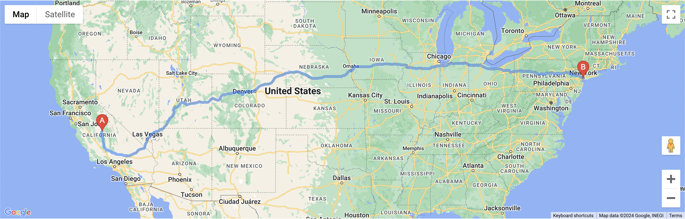
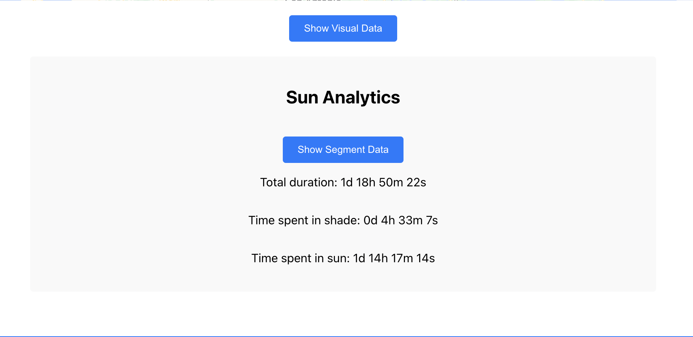

# UnSunny

UnSunny is a React-based web application that helps users find the optimal side to sit on in a vehicle to get maximum shade during a route. The app uses Google Maps for route plotting and SunCalc for calculating sun position.

## Features

- Route plotting for driving and walking using Google Maps
- Analysis of sun position along the route to suggest the optimal side for shade
- Visual and textual data representation of sun analytics
- Autocomplete input for start and end points using Google Places API
- User-friendly interface with animations

## Demo

Check out the live demo of UnSunny [here](https://prashanth-up.github.io/unsunny).

<p align="center">

</p>
<!-- <p align="center">

</p>
<p align="center">

</p>
<p align="center">

</p>
<p align="center">

</p>
<p align="center">

</p> -->


## Installation

To run this project locally, follow these steps:

1. **Clone the repository**:

   ```sh
   git clone https://github.com/prashanth-up/unsunny.git
   cd unsunny
   ```

2. **Install dependencies**:

   ```sh
   npm install
   ```

3. **Set up Google Maps API Key**:

   - Create a `.env` file in the root directory of the project.
   - Add your Google Maps API key to the `.env` file:

     ```
     REACT_APP_GOOGLE_MAPS_API_KEY=your-google-maps-api-key
     ```

4. **Run the application**:

   ```sh
   npm start
   ```

   This will start the development server and open the app in your default web browser.

## Deployment

UnSunny is deployed using GitHub Pages. To deploy your own version, follow these steps:

1. **Add deployment scripts** to your `package.json`:

   ```json
   "scripts": {
     "predeploy": "npm run build",
     "deploy": "gh-pages -d build"
   }
   ```

2. **Deploy the application**:

   ```sh
   npm run deploy
   ```

   This will build the application and deploy it to GitHub Pages.

## Project Structure

```plaintext
unsunny/
├── public/
│   ├── favicon.ico
│   ├── index.html
│   ├── logo192.png
│   ├── logo512.png
│   ├── manifest.json
│   └── robots.txt
├── src/
│   ├── components/
│   │   ├── Map.js
│   │   ├── Map.css
│   ├── pages/
│   │   ├── Home.js
│   │   ├── Home.css
│   │   ├── About.js
│   ├── services/
│   │   ├── geocode.js
│   │   ├── sunPosition.js
│   ├── utils/
│   │   └── timeConversion.js
│   ├── App.js
│   ├── App.css
│   ├── GoogleMapsLoader.js
│   ├── index.js
│   ├── index.css
├── package.json
└── README.md
```

## Technologies Used

- **React**: JavaScript library for building user interfaces
- **Google Maps API**: For route plotting and place autocomplete
- **SunCalc**: Library for calculating sun position
- **Chart.js**: For data visualization
- **React Chart.js 2**: React wrapper for Chart.js
- **GitHub Pages**: For deployment

## License

This project is licensed under the MIT License. See the [LICENSE](LICENSE) file for more information.

## Contributing

Contributions are welcome! Please open an issue or submit a pull request for any improvements or bug fixes.

## Contact

For any questions or suggestions, please don't contact [Prashanth Umapathy](mailto:please-dont-mail-me-@nope.com).
